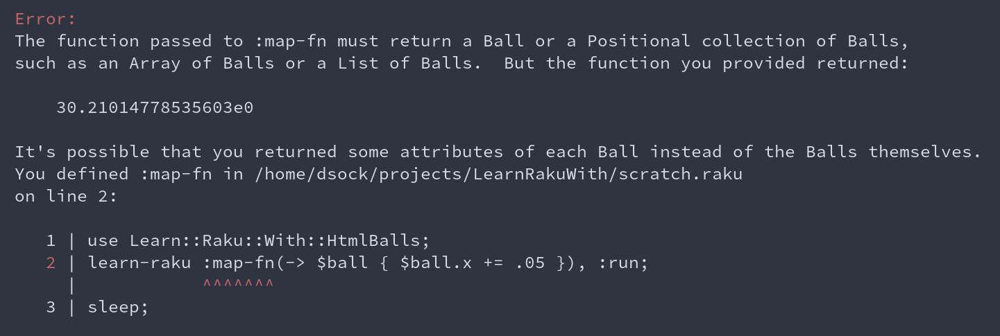

# Learn Raku With: HTML Balls

### Intro

[Raku](https://raku.org/) is, by far, the programming language I'm most excited about.  It's
powerful, expressive, extensible, and flexible enough to support whatever programming paradigm best
suits a task. In fact, I gave a talk last year at FOSDEM about why [Raku is the ideal language for
writing free
software](https://archive.fosdem.org/2021/schedule/event/programming_lang_for_free_software/).  So
it's fair to say that I think as many people as possible should learn the language.

Fortunately, Raku is pretty easy to learn (in the same way as chess or
[go](https://en.wikipedia.org/wiki/Go_(game)) – easy to learn; difficult to master) and existing
Rakoons have written many great resources to help you teach yourself.  The [main
docs](https://docs.raku.org/) do a good job of teaching the language (in addition to their primary
role as a reference for more experienced Rakoons).  There are also a [number of
books](https://perl6book.com/), including the in-progress [Complete Course in
Raku](https://course.raku.org) (funded via a [grant from
YAS](https://news.perlfoundation.org/post/grant_proposal_a_complete_perl) and thus freely
available).  Programmers who aren't feeling up to working through a full book could also check out
the [Raku Guide](https://raku.guide/) or could [Learn Raku in Y
minutes](https://learnxinyminutes.com/docs/raku/).  And if you get stuck on anything, the community
is very willing to help out on [IRC](https://kiwiirc.com/nextclient/irc.libera.chat/#raku), [Stack
Overflow](https://stackoverflow.com/tags/raku), or the
[r/rakulang](https://www.reddit.com/r/rakulang/) subreddit.

### The problem

But, despite all those resources, Raku is slightly harder to get started with than some other
languages in one way: There's not a built-in way to get started with beginner code in a way that
immediately produces _visual_ results.  If you're the sort of person who likes printing output to
`STDOUT`, then it's easy to write your first several Raku scripts.  But, if you'd like to display
shapes or do other visual tasks, Raku doesn't offer the same out-of-the-box experience as
languages like JavaScript, [Racket](https://docs.racket-lang.org/quick/index.html), or
[Pharo](https://pharo.org/features.html).

I got thinking about this the other day after reading a recent [post on
r/rakulang](https://www.reddit.com/r/rakulang/comments/pvdpd2/recreate_javascript_bouncing_balls_in_raku/).
The post's author described themselves as “an old FORTRAN programmer trying to teach himself raku”
and asked whether there was any way to use Raku to recreate a [bouncing balls
demo](https://www.youtube.com/watch?v=hoWjnidQOms) that seemed like a good learning exercise. The
consensus in the replies is that there currently isn't.

And that struck me as a real shame – I decided that there really _ought_ to be a simple and visual
way to get write a basic Raku program and see a ball bounce across your screen.  So I decided to
make one.


### The solution: Learn::Raku::With::HtmlBalls

This repo contains the code for a Raku module that allows you to write simple Raku programs to display 
balls in a web browser.  Here's how it works:

0. Install [Raku] and [Zef] if you don't have them already (I recommend the
   [rakudo-pkg](https://github.com/nxadm/rakudo-pkg) installation method), and make sure you have a
   recent enough version of Zef to support the [Fez](https://github.com/tony-o/raku-fez) ecosystem
   (you probably do).
1. run `zef install Learn::Raku::With` to install this module.
2. Write a script that imports this module, uses the `learn-raku` function (described below) to
   place/move balls, and then sleeps.  Then run that script from your shell (e.g., with `raku script.raku`).
3. View the balls in your browser at `localhost:10000` (or set a different address with the
   `LRW_HOST` and `LRW_PORT` environmental variables).
   

That's really all there is to it!

### The API

The point of this program is to help people learn _Raku_, not a custom API.  So the options for
manipulating your balls are deliberately minimalist.  Specifically, you get one object (`Ball`) and
one function (`learn-raku`).

Each `Ball` has four mutable attributes: 

 - `x`      - the distance from the left of the screen to the ball's center (as a percentage; 0 for the
   left edge, 100 for the right)
 - `y`      - the distance from the top of the screen (also as a percent)
 - `radius` - the Ball's radius as a percent of the smaller of the screen's width or height 
 - `color` - a string expressing the Ball's color, with any valid [CSS color
   value](https://developer.mozilla.org/en-US/docs/Web/CSS/color).

You can omit any or all of these attributes when making a new Ball; any ones you leave out will be
filled in with random reasonable defaults.

The `learn-raku` function accepts three named arguments.

 - `run`     - starts the server (with a True value) or stops it (with a False one)
 - `@balls` - changes the current Ball(s) to the ones you provide.  If omitted, you start with one
   Ball.
 - `&map-fn` - a function that moves the Ball/produces new Balls based on the current ones.  If
   omitted, the Balls don't move.
   
A few more words about the `&map-fn` parameter.  This function will be called 60 times per second
with all the Balls that are currently on the screen and its return value (which must be a Ball or a
List or Array of Balls) will be used as the Balls for the next frame.  Actually, `&map-fn` can be
used in two ways: it can take and return a _single_ Ball, in which case it will be called once on
every displayed Ball – this form is convenient if you only have one ball or want all balls to obey
the same rule.  Alternately, it can take an Array of Balls, in which case it will be called once
with the entire Array and should return a new Array or List.

That one function and its three arguments are the entirety of the API in this module – the rest is
up to you (and all the power built in to Raku!)

### Learn::Raku::With ... examples
 
The simplest script you can write is using this module is 

```raku
use Learn::Raku::With::HtmlBalls;
learn-raku :run;
sleep;
```

This places a single Ball randomly on the screen.  Or you could place two overlapping Balls like so:

```raku
use Learn::Raku::With::HtmlBalls;
learn-raku :balls[ Ball.new(:x(50), :y(50), :color<#f7347a>), 
                   Ball.new(:x(50), :y(50), :color<rebeccapurple>)],
           :run;
sleep;
```

If you want a Ball that moves, a simple option would be 

```raku
use Learn::Raku::With::HtmlBalls;
learn-raku :map-fn(-> $ball { $ball.x += .05; $ball }), :run
# Remember that you need to return the new ball ^^^^, not just modify one
sleep;
```

You can check out the [examples](./examples) directory for a few more simple examples.  PRs are
welcome if you'd like to add more!


### Learn::Raku::With ... error messages

The Raku community has a deep commitment to helpful error messages – in fact, we like to say that
any error message that's LTA ([Less Than
Awesome](https://perl6advent.wordpress.com/2016/12/23/day-23-everything-is-either-wrong-or-less-than-awesome/))
represents a bug.  I really love this approach – especially when first starting out, it's very
helpful to have the compiler/interpreter on your side.

So, for this module, I've tried to not only take embrace Raku's approach to awesome errors, but to
actually turn it up to 11: I've augmented normal error messages with a bit more color, extracts from
your script's source code, and extra info based on the Learn::Raku::With context.  For example, in
the last section I noted that you need to remember to return a Ball even if you modify one in place.
Here's the error message that script would generate if you forgot:



Because Learn::Raku::With has more context about how it can be used, it can offer you more info when
things go wrong – and hopefully better advice as well.  I encourage you to play around and
experiment; if things go well, you'll learn something new and if you get an error, you'll probably
learn from that as well.  If you run into any LTA error messages when using this module, please feel
free to open an issue (either with this module for custom error or with
[Rakudo](https://github.com/rakudo/rakudo) for the standard error messages it generates).


### Learn::Raku::With ... your REPL

Speaking of playing around and experimenting, part of my goal for Learn::Raku::With was to build
something that you can use from Raku's
[REPL](https://en.wikipedia.org/wiki/Read%E2%80%93eval%E2%80%93print_loop) (which you can access by
running `raku` without any arguments on the command line or, most likely, from inside your
editor/IDE of choice).

And, sure enough, the using the same API described above in your REPL Just Works™.  Once you've run
`use Learn::Raku::With::HtmlBalls` in your REPL session, you can call `learn-raku` just as you
normally would – except that now the effects of your each function call are immediately reflected in
your browser and certain errors that would end execution of your script just return you to the REPL
prompt.  Pretty much the only downside to working in your REPL is that, without line numbers to work
from, Learn::Raku::With can't print the exact code line of your error – but you probably just typed
it in anyway!

My hope is that learning Raku in a REPL-friendly way will help shorten your feedback loop and give
you something that approaches true [interactive
development](https://www.youtube.com/watch?v=8QiPFmIMxFc).

### Learn::Raku::With ... the source code

I also hope that the source code for Learn::Raku::With can serve as a learning resource for more
intermediate/advanced Rakoons.  One problem I've often run into when learning new programming
languages is that finding "medium" example programs can be a bit tricky.  It's easy enough to find
small programs that are well written (for example, on [Rosetta
Code](http://rosettacode.org/wiki/Category:Raku) or similar sites).  And the [language
compiler](https://github.com/rakudo/rakudo) or major [frameworks](https://github.com/rakudo/rakudo)
or [tools](https://github.com/rakudo/rakudo) typically provide excellent examples of large programs.
But finding a smallish-but-not-tiny program – one that's small enough to wrap your head around when
you're still learning, but big enough to learn more advanced patterns – can be a bit more
challenging.

I hope that Learn::Raku::With can fit in that middle category.  Not counting error handling,
testing, or the HTML template, the program is contained in a single file that's shorter than this
`README`.  (At release, it's 118 lines of code + 32 comments + 25 blank = 175 total lines.)  I've
also done my best to use a simple (arguably simplistic?) design – or at least as simple as possible
for a highly concurrent program.  The program's high-level design is described in the
[architecture.md](./architecture.md) document in this repo, but the short version is that it's
essentially a (very) simplified version of [Phoenix LiveView](https://www.phoenixframework.org/)
that streams JSON to a web browser at 60 fps – something it can only get away with because it's
designed to be run locally rather than over an HTTPS connection.


### Learn::Raku::With ... other Rakoons

Tight feedback loops are great, but learning is an inherently collaborative process.  If you get
stuck, _please_ ask for help – either by opening an issue here, asking on the [#raku IRC
channel](https://kiwiirc.com/nextclient/irc.libera.chat/#raku) (I'm `codesections` on IRC and pretty
much everywhere else), or by posting a question to StackOverflow (the Raku tag is mostly
watched/moderated by Rakoons and thus tends to be a friendlier corner of the site).

And if you learn something from Learn::Raku::With or build something cool, I'd love to hear about
it.  It might make a good example to add to the examples folder, or it might just be a neat demo.
But, either way, I'd be interested to see what you create.

Happy hacking! 

